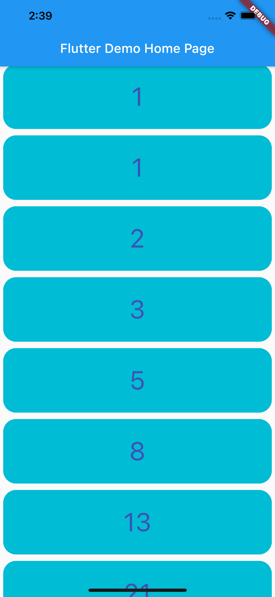

# Listes et ListView

<Row>

<Column>

:::tip Avant la séance

Vous regarderez la doc officielle **[ici](https://flutter.dev/docs/cookbook/lists/basic-list)**

Vous regardez l'exemple de code **[demo de liste](https://github.com/departement-info-cem/5N6-mobile-2/releases/latest/download/code-liste.zip)**

:::

</Column>

<Column>

:::info Séance 1 : listes

On regardera comment construire une liste d'objets simple puis un peu plus complexe.

On expliquera le concept d'expression lambda qui est souvent utilisé pour décrire comment produire l'objet graphique correspondant à l'objet de données.

:::

:::info Séance 2 : listes intégration

Compléter les exercices

:::

</Column>

</Row>

:::note Exercices

### Exercice ordre_alpha

Tirer une liste de 5 prénoms et la mélanger

Sur chaque élément de la liste un bouton pour monter et un bouton pour descendre.

Quand la liste est dans l'ordre, on affiche un message et on remélange.

### Exercice jolie_liste_lambda

<Row>

<Column size="9">

Affiche les nombres de la suite de Fibonacci dans un joli format (changer le padding, le style du texte, les bordures, etc.)

La liste doit être construite à l'aide d'une expression lambda.

</Column>

<Column size="3">

</Column>

</Row>

### Exercice jolie_liste_builder

Reprendre le dernier exercice, mais cette fois la liste doit être construite à l'aide d'un listview.builder.

:::
