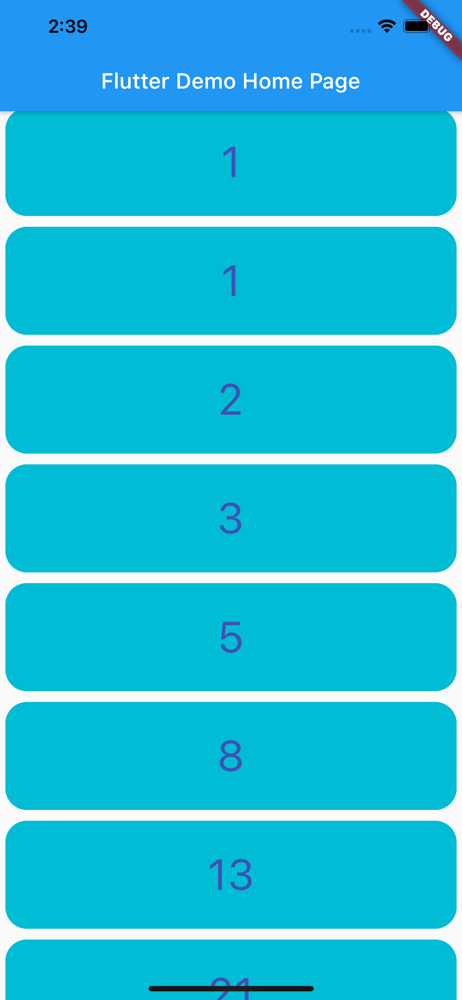

# 2.2 - Liste 📋

:::tip Avant la séance

Regardez la documentation de Flutter sur les **[listes simples](https://flutter.dev/docs/cookbook/lists/basic-list)** et sur les **[listes longues](https://docs.flutter.dev/cookbook/lists/long-lists)**.

Révisez et exécutez le code de la recette du [Rappel sur les fonctions anonymes (Lambda) 🥸](../03-recettes/rappel-lambda.md)

Nous vous recommandons d'utiliser des listes simples lorsque le contenu de la liste ne change pas (ex : un menu), et des listes longues lorsque le contenu est dynamique (ex : provient d'une source externe).

:::

:::info Séance

Nous expliquerons le concept d'expression lambda qui est souvent utilisé pour décrire comment produire l'objet graphique correspondant à l'objet de données.

:::

:::note Exercices

### Exercice ordre_alpha

Tirer une liste de 5 prénoms et la mélanger

Sur chaque élément de la liste un bouton pour monter et un bouton pour descendre.

Quand la liste est dans l'ordre, on affiche un message et on remélange.

### Exercice jolie_liste_lambda

<Row>

<Column size="9">

Affiche les nombres de la suite de Fibonacci dans un joli format (changer le padding, le style du texte, les bordures, etc.)

La liste doit être construite à l'aide d'une expression lambda.

</Column>

<Column size="3">

</Column>

</Row>

### Exercice jolie_liste_builder

Reprendre le dernier exercice, mais cette fois la liste doit être construite à l'aide d'un listview.builder.

:::
