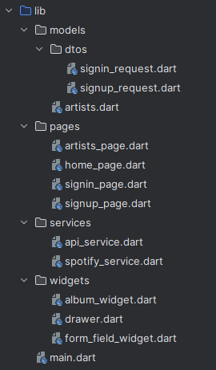
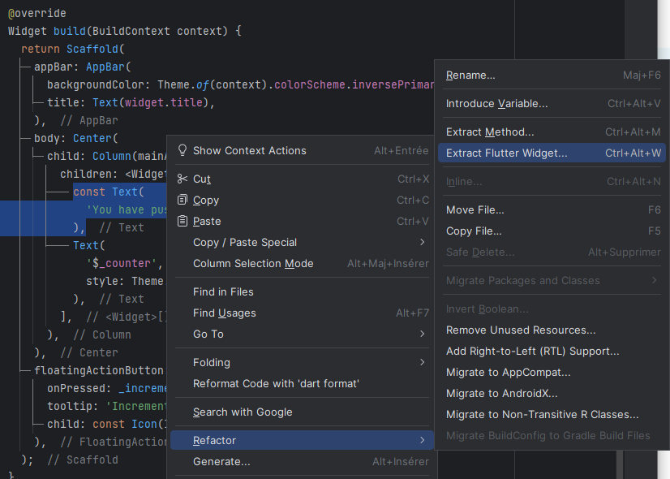

# Organisation du code

<Row>

<Column>

:::tip Avant la séance :

### Organisation du code

Nous vous suggérons cette organisation de fichiers et de dossiers

### Extraire des widgets

En général, on dit comme règle qu'une méthode ne devrait pas faire plus d'un écran.
Ainsi, si vous avez un widget qui a une méthode build() qui est plus grande qu'un écran, mieux vaut en extraire quelques widgets pour mieux organiser notre code.

### Public et privé

En Dart, il n'y pas de mots clés pour `public` `private` et `protected`, on utilise plutôt le souligner `_` pour ajouter une variable privée à une librairie.

De plus, en Dart tout fichier (plus ses `part`) est considéré comme une librairie.

:::

</Column>

<Column>

:::info Séance :

On discutera de comment structurer notre code efficacement.

On discutera des outils à notre disposition pour diviser nos widgets. Nous établirons également des règles générales pour diviser nos widgets et notre code.

On discutera des variables publiques et privées en Dart.

:::

</Column>

</Row>

:::note Exercices

### Exercice organisation

Prendre le projet suivant: **[Code à organiser](_24-organisation/organisation.zip)**

Extraire des widgets de la méthode build pour la rendre plus lisible.

Vous devriez avoir au minimum

- Un widget réutilisable pour afficher le drawer
- Un widget réutilisable pour afficher un chat
- Une méthode pour afficher la bannière du haut
- Une méthode pour afficher le ListView

:::
