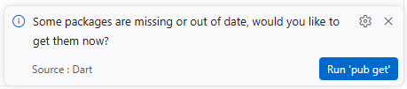

# Lancer un projet fourni 🤐

Une fois l'archive d'un projet fourni extraite, voici ce qu'il vous reste à faire.

## Dépendances 🚬

Flutter est un Framework, ce qui signifie que le projet repose lourdement sur des librairies disponibles en ligne. Il faut donc les télécharger. Pour ce faire vous avez 2 choix :

1. Cliquer sur le bouton **Run 'pub get'** de la notification qui est probablement apparue à l'ouverture du projet dans Visual Studio Code. 

2. Dans un terminal placé à la racine de votre projet, exécutez la commande `flutter pub get`.

## TODO ✅

Nous allons parfois vous demander d'explorer les TODO qui sont dans un projet. Pour faciliter la navigation, nous avons préinstallé cette [extension](https://marketplace.visualstudio.com/items?itemName=FanaticPythoner.better-todo-tree) sur les postes du CÉGEP.

1. Cliquez sur l'icône de l'extension  dans le menu à gauche de Visual Studio Code.
2. Explorez les TODO.

:::info
Vous pouvez *presque* toujours ignorer les TODO qui sont dans `/android/app/build.gradle.kts` puisqu'ils sont générés dans tous les projets de départ de Flutter.
:::
