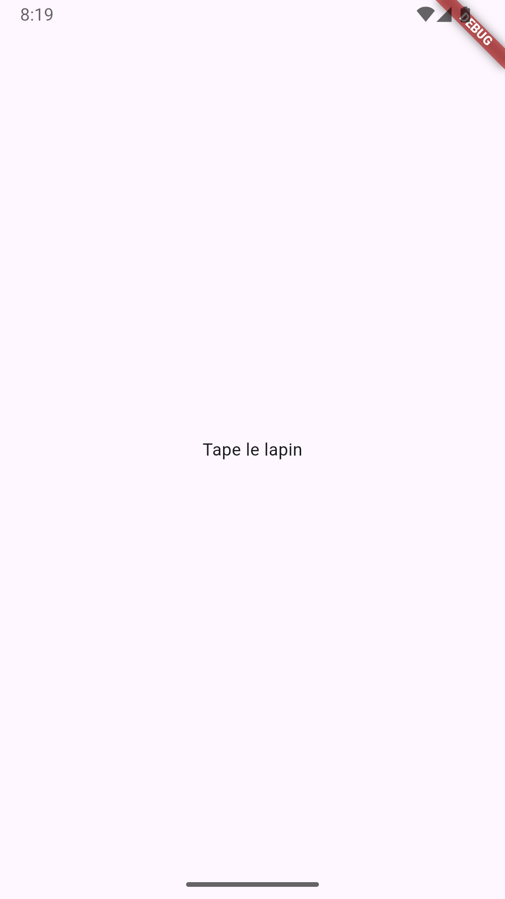

# Tape le lapin 🐇

## Objectifs 🎯

- Se familiariser avec les outils de développement
- Se familiariser avec les concepts de Flutter et de Dart
- Produire une première application fonctionnelle
- **PAS BESOIN** de tout comprendre

:::danger
Même si c'est tentant, nous vous recommendons exceptionnellement de ne pas copier-coller le code fournis dans votre projet. C'est mieux de le faire "à bras" 💪.
:::

## Règles du jeu 📐

Vous avez peut-être déjà entendu parler de ["Wack a mole" ou "Tape-Taupe"](https://www.youtube.com/watch?v=TZdPNt1_nbE&t=6s). C'est essentiellement ce que nous tenterons de réaliser aujourd'hui.

Quelques règles : 

- 4 boutons affichent 3x 🐹 et 1x 🐇, placés aléatoirement
- Quand on appuie sur 🐇, un compteur vert "Bonk" est augmenté de 1
- Quand on appuie sur 🐹, un compteur rouge "Zloop" est augmenté de 1
- À chaque fois qu'on appuie sur un bouton, l'emplacement des 3 🐹 et du 🐇 est mélangé parmis les boutons

## Créer le projet

- Dans Visual Studio Code, assurez vous d'avoir sélectionné le profil **Mobile** pour Visual Studio Code, dans  > Profile > Mobile
- Taper le raccourci `Ctrl+Shift+P`, taper **Flutter** et sélectionner **Flutter : New Project**.
- Sélectionner **Application**.
- Dans l'explorateur, sélectionner le dossier où vous stockez vous exercices.
- Tapez **tape_le_lapin** comme nom du projet.
- Cochez seulement **android**.
- Une nouvelle fenêtre va s'ouvrir. Vous pouvez resélectionner le profil **Mobile** au besoin.
- La création des fichiers et dossiers de départ peut prendre quelques secondes.
- Lancez le projet pour vous assurez que tout fonctionne.
- Commit + push

:::tip
En Flutter, tous les noms de dossier sont en [snake_case 🐍](https://developer.mozilla.org/fr/docs/Glossary/Snake_case).
:::

:::danger Attention!
Flutter est **très** capricieux sur les chemins où sont les projets. Il n'accepte pas d'avoir des caractères spéciaux comme `é` ou `a`, et pas d'espace.

- **Exemple invalide :** `C:\Users\123456\Desktop\Jean-Mathéo Premier\tape_le_lapin`
- **Exemple valide   :** `C:\Users\123456\Desktop\Jean-Matheo_Premier\tape_le_lapin`
:::

## L'interface graphique

Nous allons placer les éléments graphiques avant de leur donner un comportement.

### Préparation

Le fichier `main.dart` qui est dans `lib/` est celui que nous allons modifier. Beaucoup de code a été généré, mais nous allons complètement l'enlever pour le moment. Nous vous recommendons tout de même d'y jeter un coup d'oeil à un autre moment.

Tout ce que nous voulons garder est cette fonction d'entrée `main`, et la classe `MyApp`. On peut supprimer le reste qui est en dessous. Vous pouvez aussi enlever tous les commentaires, et retirer `title: 'Flutter Demo Home Page'` à la ligne TODO. 

Voici ce qui devrait vous rester :

```dart
void main() {
  runApp(const MyApp());
}

class MyApp extends StatelessWidget {
  const MyApp({super.key});

  @override
  Widget build(BuildContext context) {
    return MaterialApp(
      title: 'Flutter Demo',
      theme: ThemeData(colorScheme: .fromSeed(seedColor: Colors.deepPurple)),
      home: const MyHomePage(),
    );
  }
}
```

À ce point, `MyHomePage` devrait être souligné en rouge. C'est normal puisque nous venons d'enlever la classe à laquelle il faisait référence. Nous allons rajouter la classe manquante. 

Créez un nouveau dossier nommé `pages` dans le dossier lib. Dans ce dossier, créez un fichier nommé `lapin.dart`.

Dans le fichier créé commencez à taper **stfu**, puis ouvrez l'intellisense en appuyant sur **Ctrl+Espace**. Vous devriez pouvoir sélectionner une entrée nommée **Flutter Stateful Widget**. Nommez votre nouveau Widget `MyHomePage`.


On remplace `const Placeholder()` par Scaffold comme suit : 

```dart
import 'package:flutter/material.dart';

class MyHomePage extends StatefulWidget {
  const MyHomePage({super.key});

  @override
  State<MyHomePage> createState() => _MyHomePageState();
}

class _MyHomePageState extends State<MyHomePage> {
  @override
  Widget build(BuildContext context) {
    return Scaffold(body: const Center(child: Text('Tape le lapin')));
  }
}
```

<Row>
<Column>
De retour dans `main.dart`, positionnez vous sur `MyHomePage`, qui devrait être encore rouge. Appuyez sur **Ctrl+.** (point). Vous aurez l'option d'importer le Widget que nous venons de créer :
</Column>
<Column></Column>
</Row>

<Row>
<Column size="9">
Relancez l'application. Vous devriez maintenant voir **"Tape le lapin"** centré.

Si tout fonctionne bien, COMMIT + PUSH.
</Column>
<Column size="3"></Column>
</Row>


### Bonk et Zloop

### Titre

### Boutons

## Comportement

Maintenant que nous avons l'interface graphique, nous allons implémenter le comportement.

### Réagir aux clics

### Mélanger