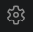
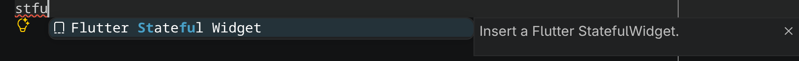
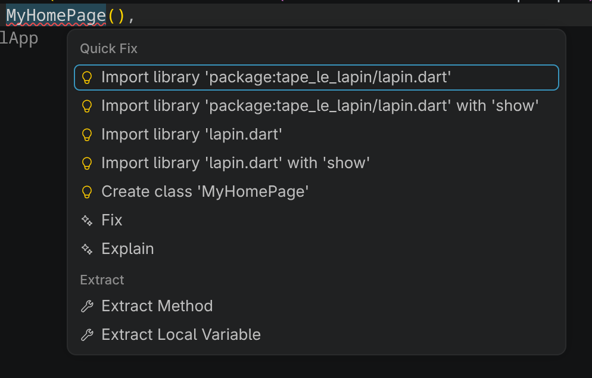
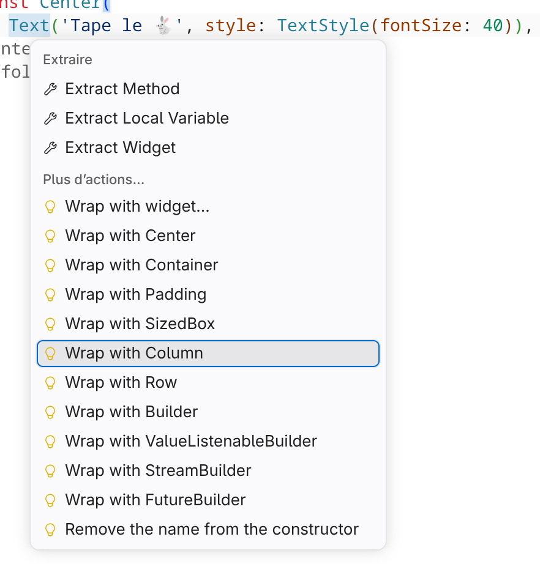

# Tape le 🐇

## Règles du jeu 📐

Vous avez peut-être déjà entendu parler de ["Whack-a-mole" ou "Tape-Taupe"](https://www.youtube.com/watch?v=TZdPNt1_nbE&t=6s). C'est essentiellement ce que nous tenterons de réaliser aujourd'hui.

Quelques règles : 

- 4 boutons affichent 3x 🐹 et 1x 🐇, placés aléatoirement
- Quand on appuie sur 🐇, un compteur vert "Bonk" est augmenté de 1
- Quand on appuie sur 🐹, un compteur rouge "Zloop" est augmenté de 1
- À chaque fois qu'on appuie sur un bouton, l'emplacement des 3 🐹 et du 🐇 est mélangé parmi les boutons

## Créer le projet

- Dans Visual Studio Code, assurez-vous d'avoir sélectionné le profil **Mobile** dans  > Profile > Mobile. <NonVoyant>Pour étudiant non voyant, assurez vous d'avoir installé les plugins Visual Studio Code Flutter et Dart</NonVoyant>
- Tapez le raccourci `Ctrl+Shift+P`, tapez **Flutter** et sélectionnez **Flutter : New Project**.
- Sélectionnez **Application**.
- Dans l'explorateur, sélectionnez le dossier où vous stockez vos exercices.
- Tapez **tape_le_lapin** comme nom du projet.
- Cochez seulement **android**.
- Une nouvelle fenêtre va s'ouvrir. Vous pouvez resélectionner le profil **Mobile** au besoin.
- La création des fichiers et dossiers de départ peut prendre quelques secondes.
- Lancez le projet pour vous assurer que tout fonctionne.
- Commit + push

:::tip
En Flutter, tous les noms de dossier sont en [snake_case 🐍](https://developer.mozilla.org/fr/docs/Glossary/Snake_case).
:::

:::danger Attention!
Flutter est **très** capricieux sur les chemins où sont les projets. Il n'accepte pas d'avoir des caractères spéciaux comme `é` ou `à`, et pas d'espace.

- **Exemple invalide :** `C:\Users\123456\Desktop\Jean-Mathéo Premier\tape_le_lapin`
- **Exemple valide   :** `C:\Users\123456\Desktop\Jean-Matheo_Premier\tape_le_lapin`
:::

## L'interface graphique

Nous allons placer les éléments graphiques avant de leur donner un comportement.

### Préparation

Le fichier `main.dart` qui est dans `lib/` est celui que nous allons modifier. Beaucoup de code a été généré, mais nous allons complètement l'enlever pour le moment. Nous vous recommandons tout de même d'y jeter un coup d'œil à un autre moment.

Tout ce que nous voulons garder est cette fonction d'entrée `main`, et la classe `MyApp`. On peut supprimer le reste qui est en dessous. Vous pouvez aussi enlever tous les commentaires, et retirer `title: 'Flutter Demo Home Page'` à la ligne TODO. 

Voici ce qui devrait vous rester :

```dart
void main() {
  runApp(const MyApp());
}

class MyApp extends StatelessWidget {
  const MyApp({super.key});

  @override
  Widget build(BuildContext context) {
    return MaterialApp(
      title: 'Flutter Demo',
      theme: ThemeData(colorScheme: .fromSeed(seedColor: Colors.deepPurple)),
      home: const MyHomePage(),
    );
  }
}
```

À ce point, `MyHomePage` devrait être souligné en rouge. C'est normal puisque nous venons d'enlever la classe à laquelle il faisait référence. Nous allons rajouter la classe manquante. 

Créez un nouveau dossier nommé `pages` dans le dossier lib. Dans ce dossier, créez un fichier nommé `lapin.dart`.

Dans le fichier créé, commencez à taper **stfu**, puis ouvrez l'IntelliSense en appuyant sur **Ctrl+Espace**. Vous devriez pouvoir sélectionner une entrée nommée **Flutter Stateful Widget**. Nommez votre nouveau widget `MyHomePage`.



On remplace `const Placeholder()` par Scaffold comme suit : 

```dart
import 'package:flutter/material.dart';

class MyHomePage extends StatefulWidget {
  const MyHomePage({super.key});

  @override
  State<MyHomePage> createState() => _MyHomePageState();
}

class _MyHomePageState extends State<MyHomePage> {
  @override
  Widget build(BuildContext context) {
    return Scaffold(body: const Center(child: Text('Tape le 🐇')));
  }
}
```

<Row>
<Column vCenter={true}>
De retour dans `main.dart`, positionnez-vous sur `MyHomePage`, qui devrait être encore rouge. Appuyez sur **Ctrl+.** (point). Vous aurez l'option d'importer le widget que nous venons de créer.
</Column>
<Column></Column>
</Row>

Relancez l'application. Vous devriez maintenant voir **"Tape le 🐇"** centré.

Si tout fonctionne comme prévu, COMMIT + PUSH.

### Titre

Retour dans `lapin.dart`.

Le titre est bien, mais rendons-le un peu plus gros :

```dart
Text('Tape le 🐇')
```

devient 

```dart
Text('Tape le 🐇', style: TextStyle(fontSize: 40))
```

### Découpage

Pour arriver à placer les prochains éléments, il va falloir séparer l'interface en 3 sections empilées les unes sur les autres :

- Titre (Déjà fait)
- Résultats (nombre de Bonk et de Zloop)
- Boutons pour jouer

<Row>
<Column vCenter={true}>
Nous allons enrober le widget **Text** par un autre widget **Column**.

Positionnez votre curseur sur le widget **Text**, et appuyez sur **Ctrl+.** (point).

Cela fera apparaître un menu contextuel. Sélectionnez l'option pour enrober avec une **Column**.
</Column>
<Column>

</Column>
</Row>

On se retrouve avec le résultat suivant :

```dart
Center(
  // highlight-start
  child: Column(
    children: [
        Text('Tape le 🐇', style: TextStyle(fontSize: 40))
      ],
  ),
  // highlight-end
),
```

Le widget **Text** est maintenant le premier élément dans une liste de widgets qui va du haut vers le bas.

:::tip child 👶 vs children 👶👶👶
Vous remarquerez que la plupart des Widgets ont un attribut :

- **child** : qui accepte un seul Widget enfant, ou
- **children** : qui accepte un tableau d'enfants  
:::

### Bonk et Zloop

Maintenant les résultats pour compter combien de fois nous avons réussi à taper le 🐇 (Bonk), et combien de fois on s'est trompé en appuyant sur le 🐹 (Zloop). On veut afficher **Bonk : x** et **Zloop : y** côte à côte, sous le titre créé précédemment.

On ajoute donc une **Row** sous le **Text**.

```dart
Column(
  children: [
    Text('Tape le 🐇', style: TextStyle(fontSize: 40)), // <- Ne pas oublier la virgule ici
    // highlight-start
    Row(
      children: [
        Text("Bonk : x"),
        Text("Zloop : y")
      ]
    ),
    // highlight-end
  ],
),
```

Nos widgets sont bien alignés de gauche à droite, mais ils pourraient être mieux positionnés.

```dart
Row(
  // highlight-next-line
  mainAxisAlignment: MainAxisAlignment.spaceEvenly,
  children: [
    Text("Bonk : x"),
    Text("Zloop : y")
  ],
),
```

Et un peu de style :

```dart
Row(
  mainAxisAlignment: MainAxisAlignment.spaceEvenly,
  children: [
    Text(
      "Bonk : x",
      // highlight-next-line
      style: TextStyle(color: Colors.green, fontSize: 30),
    ),
    Text(
      "Zloop : y",
      // highlight-next-line
      style: TextStyle(color: Colors.red, fontSize: 30),
    ),
  ],
),
```

### Boutons

Pour les boutons, nous allons afficher une grille de 2x2 boutons, qui vont tous afficher 🐹 pour le moment.

```dart
Column(
  children: [
    const Text('Tape le 🐇', style: TextStyle(fontSize: 40)),
    const Row(
      mainAxisAlignment: MainAxisAlignment.spaceEvenly,
      children: [
        Text(
          "Bonk : x",
          style: TextStyle(color: Colors.green, fontSize: 30),
        ),
        Text(
          "Zloop : y",
          style: TextStyle(color: Colors.red, fontSize: 30),
        ),
      ],
    ),
    // highlight-start
    GridView.count(
      shrinkWrap: true,  // Dimensionner selon le contenu 
      physics: NeverScrollableScrollPhysics(), // Empêcher de scroller4
      crossAxisCount: 2, // Nombre de colonnes
      children: [
        
      ],
    ),
    // highlight-end
  ],
),
```

Une erreur surgit! Essayez de corriger l'erreur par vous-même. Pour y arriver, au besoin :

- Lis le message d'erreur surligné en rouge dans Visual Studio Code
- Lis le message d'erreur dans la console d'exécution Flutter
- Fais une recherche sur internet
- Regarde ce que l'IntelliSense de Visual Studio Code te propose

Si tu bloque pendant 5 minutes, appelle ton enseignant.

Ajoutons maintenant les boutons :

```dart
GridView.count(
  shrinkWrap: true,  // Dimensionner selon le contenu 
  physics: NeverScrollableScrollPhysics(), // Empêcher de scroller
  crossAxisCount: 2, // Nombre de colonnes
  children: [
    // highlight-start
    ElevatedButton(onPressed: null, child: Text("🐹")),
    ElevatedButton(onPressed: null, child: Text("🐹")),
    ElevatedButton(onPressed: null, child: Text("🐹")),
    ElevatedButton(onPressed: null, child: Text("🐹")),
    // highlight-end
  ],
),
```

On verra dans l'étape suivante ce que la propriété `onPressed` fait. C'est d'ailleurs parce qu'elle est à `null` que les boutons semblent grisés.

On peut aussi grossir les boutons en leur assignant une taille un peu plus élevée, tel que vu précédemment :

```dart
Text("🐹", style: TextStyle(fontSize: 100))
```

On peut aussi ajouter un peu d'espacement entre et autour des boutons :

```dart
GridView.count(
  shrinkWrap: true, // Dimensionner selon le contenu
  physics: NeverScrollableScrollPhysics(), // Empêcher de scroller
  crossAxisCount: 2, // Nombre de colonnes
  // highlight-start
  mainAxisSpacing: 20, // Espacement vertical
  crossAxisSpacing: 20, // Espacement horizontal
  padding: EdgeInsets.all(20), // Espacement autour
  // highlight-end
  children: [
    ElevatedButton(
      onPressed: null,
      child: Text("🐹", style: TextStyle(fontSize: 100)),
    ),
    ElevatedButton(
      onPressed: null,
      child: Text("🐹", style: TextStyle(fontSize: 100)),
    ),
    ElevatedButton(
      onPressed: null,
      child: Text("🐹", style: TextStyle(fontSize: 100)),
    ),
    ElevatedButton(
      onPressed: null,
      child: Text("🐹", style: TextStyle(fontSize: 100)),
    ),
  ],
),
```

Si vous êtes habiles, vous avez remarqué que les boutons commencent à se répéter, et que chaque modification devra être appliquée 4 fois. Imaginez si c'était 10 boutons, il faudrait modifier le code 10 fois. Nous allons donc tenter une autre approche pour mieux gérer nos boutons :

```dart
GridView.count(
  shrinkWrap: true, // Dimensionner selon le contenu
  physics: NeverScrollableScrollPhysics(), // Empêcher de scroller
  crossAxisCount: 2, // Nombre de colonnes
  mainAxisSpacing: 20, // Espacement vertical
  crossAxisSpacing: 20, // Espacement horizontal
  padding: EdgeInsets.all(20), // Espacement autour
  // highlight-start
  children: List.generate(4, (index) {
    return ElevatedButton(
      onPressed: null,
      child: Text("🐹", style: TextStyle(fontSize: 100)),
    );
  }),
  // highlight-end

),
```

### Fignoler l'interface

Tout est à peu près beau. Il ne nous reste qu'à aérer les 3 sections qui sont dans la **Column**. On peut ajouter l'attribut `mainAxisAlignment: MainAxisAlignment.spaceEvenly` dans la première **Column** que nous avons créée.

Avant de continuer, validez que votre interface ressemble à ça :

<center>
<Image alt="Interface graphique complétée. De haut en bas, 3 groupes : Le titre (qui affiche Tape le et un emoji de lapin), les compteurs Bonk : x (en vert) et Zloop : y (en rouge) qui sont alignés sur une rangée, séparés, et les 4 boutons pour jouer, qui sont légèrement grisés, et affichent un emoji de hamster. Les boutons s'affichent comme une grille 2 par 2, et sont également séparés." img={require('./_tape-le-lapin/interface-fini.png')} width="400" />
</center>

## Comportement

Maintenant que nous avons l'interface graphique, nous allons implémenter le comportement.

### Score

Le score des Bonk et des Zloop est appelé à changer. Pour garder le compte, il faut déclarer des variables :

```dart
class _MyHomePageState extends State<MyHomePage> {
  int _scoreBonk = 0;

  // Reste du code
}
```

Pour afficher la valeur de ces variables dans le texte affiché, remplacer les x et y qui avaient été ajoutés :

```dart
Text(
  "Bonk : $_scoreBonk",
  style: TextStyle(color: Colors.green, fontSize: 30),
),
```

Faites pareil pour le score de Zloop.

### Position du 🐇

À chaque fois qu'on appuie sur un bouton, il faut déterminer la nouvelle position du 🐇. On veut tout de même le faire une première fois au lancement de l'application.

Pour y arriver, on doit garder en mémoire l'index de la position du 🐇 dans une variable, et utiliser l'objet **Random** pour déterminer au hasard cette position.

```dart
class _MyHomePageState extends State<MyHomePage> {
  final Random _random = Random();

  int _positionLapin = 0;
  // Autres variables

  // Reste du code
}
```

Au démarrage, on veut trouver la première position du 🐇.

```dart
class _MyHomePageState extends State<MyHomePage> {

  // Variables

  @override
  void initState() {
    super.initState();
    // Choisit un entier entre 0 et 4
    _positionLapin = _random.nextInt(4);
  }

  // Reste du code
}
```

Pour afficher le 🐇, il faut modifier le code du générateur de liste de la grille.

```dart
GridView.count(
  shrinkWrap: true, // Dimensionner selon le contenu
  physics: NeverScrollableScrollPhysics(), // Empêcher de scroller
  crossAxisCount: 2, // Nombre de colonnes
  mainAxisSpacing: 20, // Espacement vertical
  crossAxisSpacing: 20, // Espacement horizontal
  padding: EdgeInsets.all(20), // Espacement autour
  children: List.generate(4, (index) {
    // highlight-next-line
    String emoji = _positionLapin == index ? "🐇" : "🐹";
    return ElevatedButton(
      onPressed: null,
      // highlight-next-line
      child: Text(emoji, style: TextStyle(fontSize: 100)),
    );
  }),
),
```

On devrait maintenant voir 1x🐇 et 3x🐹. La position du 🐇 devrait changer à chaque redémarrage.

### Réagir aux clics

Commençons par ajouter une fonction anonyme vide. Vous pouvez vous rafraîchir la mémoire sur les [fonctions anonymes (lambda) 🥸](../03-recettes/rappel-lambda.md).

```dart
ElevatedButton(
  // highlight-start
  onPressed: () {},
  // highlight-end
  child: Text(emoji, style: TextStyle(fontSize: 100)),
);
```

Lorsqu'on tape sur un bouton, on veut :

1. Vérifier si on a tapé sur le bon bouton, et mettre à jour le compteur qui correspond à ce qui a été tapé.
2. Trouver un nouvel emplacement pour le 🐇.

```dart
ElevatedButton(
  // highlight-start
  onPressed: () {
    setState(() {
      if (index == _positionLapin) {
        _scoreBonk++;
      } else {
        _scoreZloop++;
      }

      _positionLapin = _random.nextInt(4);
    });
  },
  // highlight-end
  child: Text(emoji, style: TextStyle(fontSize: 100)),
);
```

:::info setState?
Le `setState` indique à Flutter qu'on souhaite mettre à jour l'interface graphique. Flutter va donc cibler quelles zones de l'application il doit redessiner. Vous remarquerez que tout comme `onPressed`, `setState` utilise aussi une [fonction anonyme 🥸](../03-recettes/rappel-lambda.md).
:::

Bravo 🎉! Vous avez réussi à compléter votre première application en Flutter 🐦! Nous avons vu tout ce qui devait être fait pour le cours d'aujourd'hui. Si cela vous intéresse, vous pouvez consulter la suite pour voir comment ajouter une fonctionnalité plus avancée, qui nous donnera un vrai Tape-taupe!

## Temps limité

Afin de stresser un peu notre joueur, ajoutons cette règle : **Le jeu est mélangé à toutes les secondes.**

### Minuterie

Nous allons ajouter une minuterie responsable de gérer le temps.

```dart
class _MyHomePageState extends State<MyHomePage> {
  Timer? _minuterie;
}
```

Pour éviter des problèmes pendant le développement, faisons en sorte que le minuteur soit annulé lorsque la page se ferme.

```dart
// À mettre sous le initState
@override
void dispose() {
  _minuterie?.cancel();
  super.dispose();
}
```

### Mélanger et gérer le temps

Trouver une nouvelle position pour le 🐇 va être un peu plus complexe qu'avant. Nous allons donc créer une fonction pour faire cette gestion.

```dart
// Au-dessus de la fonction build
void _nouvellePosition() {
  setState(() {
    _positionLapin = _random.nextInt(4);
  });
}
```

On peut appeler la fonction où on faisait `_positionLapin = _random.nextInt(4);` avant, soit dans la fonction `initState` et dans la fonction anonyme de l'attribut `onPressed`.

<Row>
<Column vCenter={true}>
```dart
@override
void initState() {
  super.initState();
  // highlight-next-line
  _nouvellePosition();
}
```
</Column>
<Column>
```dart
ElevatedButton(
  onPressed: () {
    setState(() {
      if (index == _positionLapin) {
        _scoreBonk++;
      } else {
        _scoreZloop++;
      }
    });
    // highlight-next-line
    _nouvellePosition(); // On sort aussi l'appel de fonction du setState, pour qu'il soit juste en dessous
  },
  child: Text(emoji, style: TextStyle(fontSize: 100)),
);
```
</Column>
</Row>

Premièrement, dans notre nouvelle fonction, on veut re-mélanger le 🐇 à toutes les secondes :

```dart
void _nouvellePosition() {
  // Arrêter la minuterie si elle est déjà démarrée
  // highlight-next-line
  _minuterie?.cancel();

  setState(() {
    _positionLapin = _random.nextInt(4);
  });

  // La fonction anonyme est appelée à toutes les secondes
  // highlight-start
  _minuterie = Timer(const Duration(seconds: 1), () {
    _nouvellePosition(); 
  });
  // highlight-end
}
```
