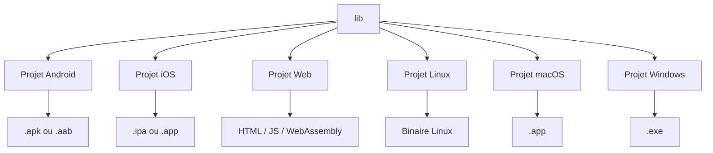

# Tour d'horizon d'un projet Flutter 🌅

## Objectif

Se familiariser avec la structure d'un projet Flutter

## Concept

L'avantage de Flutter, d'utiliser une seule base de code pour cibler plusieurs plateformes, vient avec quelques particularités. Par exemple, comment gérer certaines fonctionnalités spécifiques à Android ou iOS? Est-ce que c'est impossible d'écrire du code natif (en kotlin ou en Swift)?

C'est encore possible d'écrire du code natif, mais nous ne le feront pas vraiment dans ce cours. Flutter compile son code source vers des projets sur les différentes plateformes choisies, qui sont ensuite compilées vers des exécutables.



Chaque plateforme cible possède son propre répertoire, qui permet au développeur de venir spécifier et configurer des choses qui sont propres à chaque plateforme.


## Structure

À la création d'un nouveau projet Flutter, vous devriez vous retrouver avec la structure suivante :

```
nouveau_projet
├── android/                 : Dossier propre au projet Android.
├── build/                   : Fichiers compilés. Devrait être dans le .gitignore. N'y touchez jamais.  
├── ios/                     : Dossier propre au projet iOS.
├── lib/                     : Code source de l'application Flutter. C'est ici que vous allez passer 98% de votre temps de développement,
│   └── main.dart            : Point d'entrée de votre application. C'est le premier fichier qui sera lu lors du démarrage du projet sur une des plateformes cible.
├── linux/                   : Dossier propre au projet Linux.
├── macos/                   : Dossier propre au projet MacOS.
├── test/                    : Tests sur le code Dart
├── web/                     : Dossier propre au projet Web.
├── windows/                 : Dossier propre au projet Windows.
├── .dart_tool/              : Références internes pour Flutter. Devrait être dans le .gitignore. N'y touchez jamais.
├── .gitignore               : Même .gitignore que vous avez vus dans vos autres projets. Spécifie à Git d'ignorer les dossiers et fichiers qui y sont listés.
├── .metadata                : Fichier de référence pour Flutter, permet au framework de connaître quelles plateformes cible (et leur version) sont utilisées.
├── analysis_options.yaml    : Configuration des outils de linting. Nous n'en parlerons pas beaucoup dans le cours, mais nous vous encourageons à faire une petite recherche sur le sujet.
├── pubspec.lock             : Versions précises des packages, figées. Exactement comme package-lock.json que vous avez utilisés dans vos cours de web.
├── pubspec.yaml             : Packages qui seront utilisés dans le projet, et quelques autres configurations. Exactement comme package.json que vous avez utilisés dans vos cours de web.
└── README.md                : README classique. Permet de présenter et documenter votre projet.
```

:::tip
Explorez le dossier `android` d'un projet. Vous remarquerez que ça ressemble à peu près à ce que vous avez vu dans le cours d'applications mobiles que vous avez suivi à la session dernière. 
:::