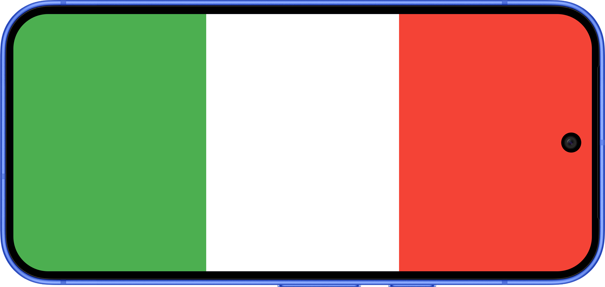

# 🤌 2.1A – drapeau_italien

Drapeau italien. Vous devez faire une mise en page qui correspond au drapeau italien qui prend toute la hauteur de l'écran et où chaque couleur utilise un tiers de la largeur de l'écran.

:::tip Bonus 1
Trouve comment enlever la bannière qui dit "DEBUG" en haut à droite de l'écran
:::

:::tip Bonus 2
Trouve comment rendre l'application plein écran, soit qu'on ne voit plus la barre qui indique l'heure et d'autres informations en haut.
:::