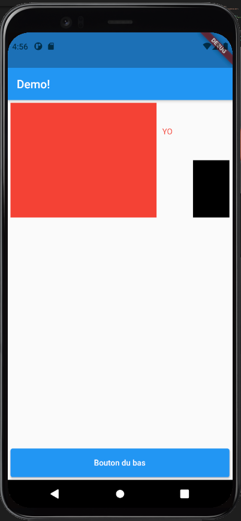

# 🤔 1.2C –  pas_si_simple

<Row>

<Column size="9">

Vous devez reproduire la mise en page de l'image suivante dans une appli Flutter appelée pas_si_simple.

Le bloc rouge doit faire 200 de haut et prendre les 2/3 de l'écran. Le bouton du bas doit être en bas.

Indice, vous allez surement mettre des Row dans des Column dans des Row dans des Column

</Column>

<Column size="3">

</Column>

</Row>