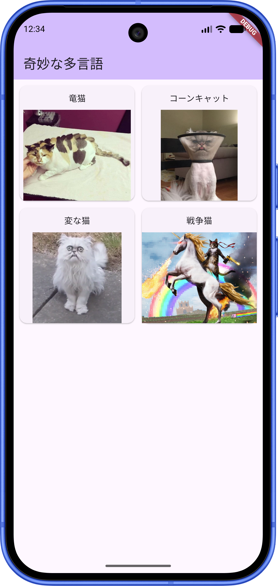

# 👺 3.1A – multilingue_bizarre

## Objectifs 🎯

- Découvrir l'internationalisation (i18n)
- Configurer des images locales (assets)
- Implémenter un affichage en grille (`GridView.builder`).

## À faire 🛠️

1. **Les Assets (Images)** : Trouvez 4 images de chats "bizarres". Vous devez les intégrer localement dans votre projet (dossier interne) plutôt que via des URLs.
2. **La Grille (`GridView.builder`)** : Reproduisez la mise en page de l'image de référence en utilisant un `GridView.builder`. Chaque élément de la grille doit être une carte contenant le nom du chat et son image. Recherche requise : comment configurer les colonnes d'un `GridView` (par exemple avec `SliverGridDelegateWithFixedCrossAxisCount`).
3. **L'internationalisation** : Configurez votre application pour qu'elle supporte trois langues : Français, Norvégien et Japonais. Le titre de l'application (dans le AppBar) ainsi que les 4 noms des chats doivent se traduire automatiquement en fonction de la langue du système.

<Row>
<Column>

</Column>
<Column>

</Column>
<Column>

</Column>
</Row>
