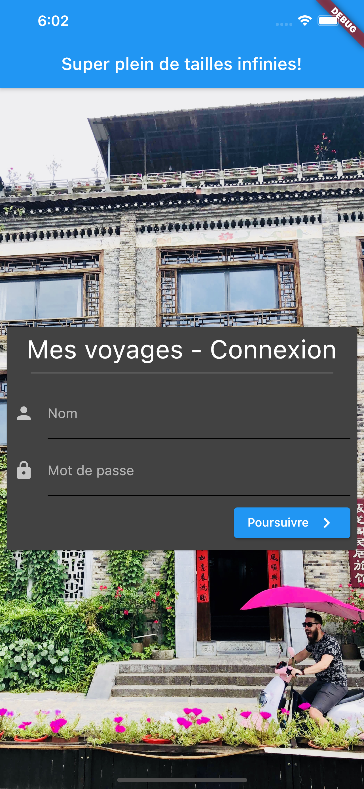
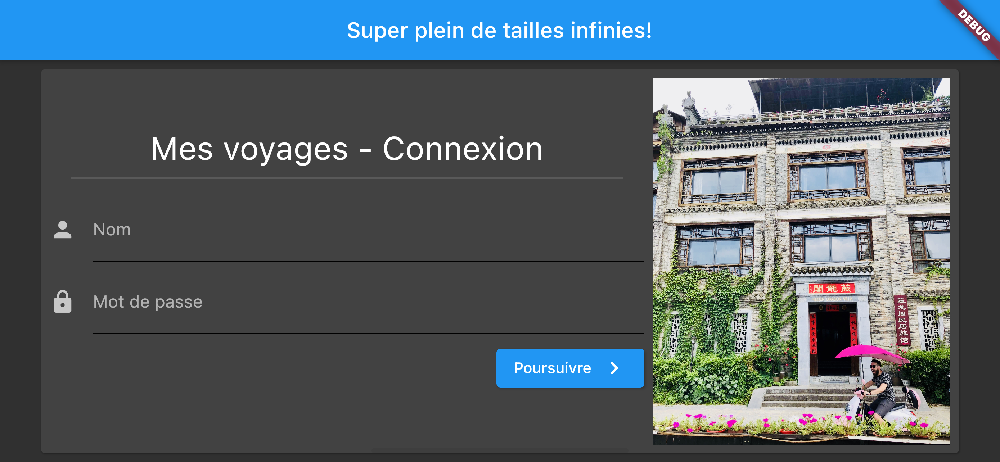

# 🤏 3.1B – plein_de_tailles

## Objectif 🎯

## plein_de_tailles

Reproduire les mises en page suivantes dans une appli Flutter appelée plein_de_tailles. Il sera essentiel que la mise en page soit jolie peu importe la taille de l'écran, l'orientation et la résolution.

Vous aurez probablement besoin d'utiliser le [OrientationBuilder](https://flutter.dev/docs/cookbook/design/orientation).

Tester votre application avec les appareils suivants:

- Pixel 10
- Pixel C

<Row>

<Column size="3">

</Column>

<Column size="9">

</Column>

</Row>

